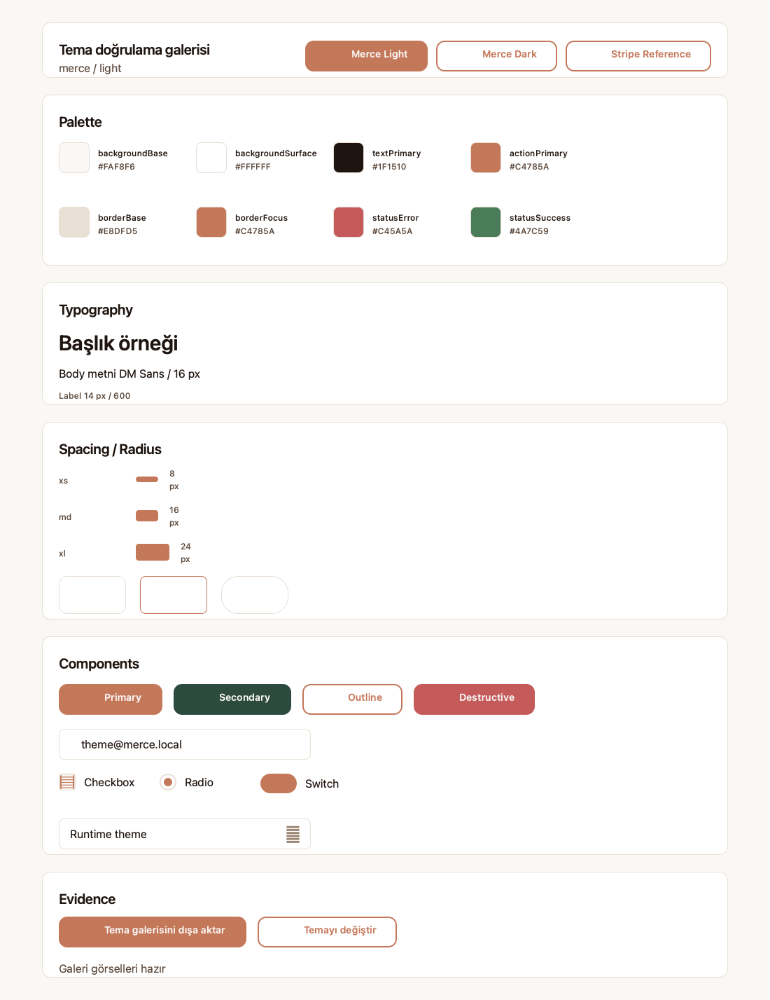
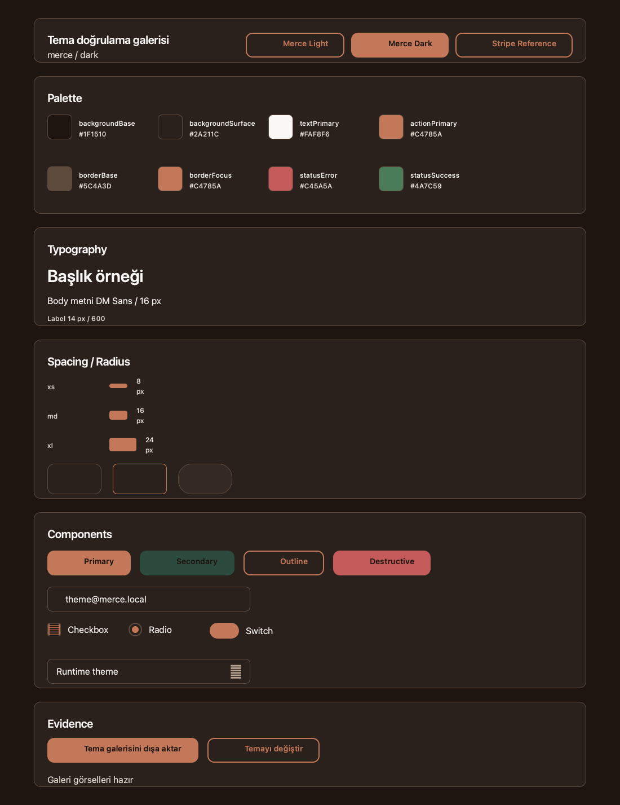
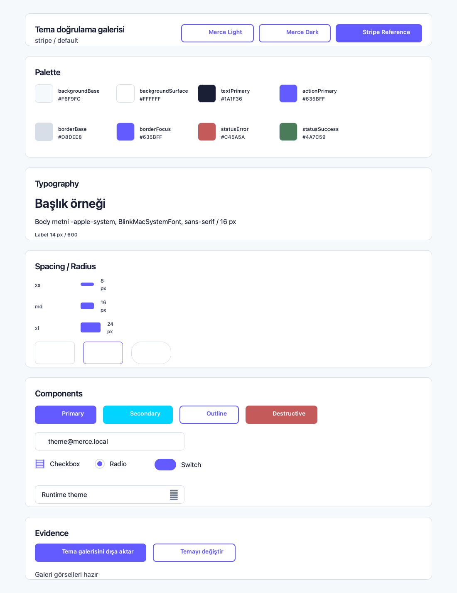

# Merce Theme Gallery Evidence

Phase 05 verifies the C++ theme runtime through QtTest, focused QML probes, the playground gallery, and reproducible visual artifacts.

## Mandatory Local Gates

Run from the repository root:

```sh
cmake --build build --target MercePlayground
cmake --build build --target tst_merce_theme_manifest_loader
ctest --test-dir build --output-on-failure
QT_QPA_PLATFORM=offscreen ./build/playground/MercePlayground --theme-probe
QT_QPA_PLATFORM=offscreen ./build/playground/MercePlayground --theme-switch-probe
QT_QPA_PLATFORM=offscreen ./build/playground/MercePlayground --smoke-test
QT_QPA_PLATFORM=offscreen ./build/playground/MercePlayground --theme-gallery-probe
QT_QPA_PLATFORM=offscreen ./build/playground/MercePlayground --export-theme-gallery docs/assets/theme-gallery
```

The export command writes fixed filenames under `docs/assets/theme-gallery`.

## Visual Artifacts

### Merce Light



### Merce Dark



### Stripe Reference



## Optional qmlagent Inspection

qmlagent is an optional inspect/debug workflow, not a CI gate.

Launch the playground manually with the QML debug service:

```sh
QT_QPA_PLATFORM=offscreen ./build/playground/MercePlayground \
  -qmljsdebugger=port:3771,host:127.0.0.1,services:QmlAgent
```

Then query stable gallery selectors:

```sh
node tools/qmlagent-probe.mjs 3771
```

The script inspects:

- `merce.playground.gallery`
- `merce.playground.gallery.activeTheme`
- `merce.playground.gallery.palette`
- `merce.playground.gallery.typography`
- `merce.playground.gallery.spacingRadius`
- `merce.playground.gallery.components`
- `merce.playground.gallery.exportStatus`

Use qmlagent diagnostics for layout/source inspection. Screenshots are fallback evidence; the checked PNG artifacts above are produced by the deterministic export command.
