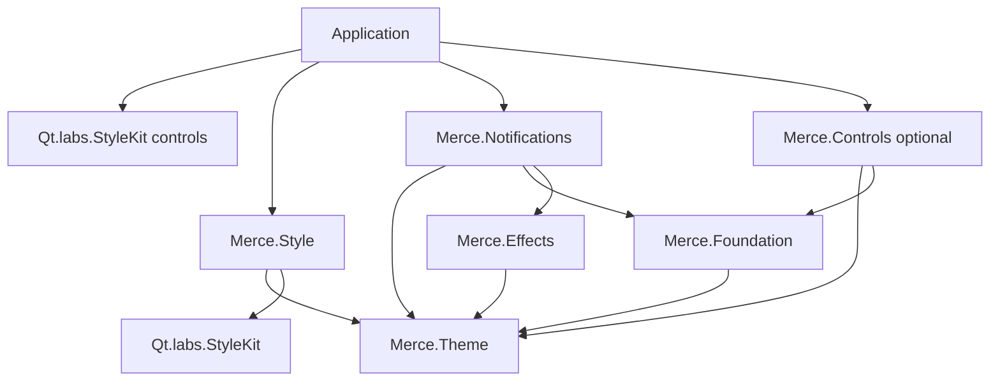

# Merce Design System - Konumlandirma

Merce artik merkezi bir QML control kutuphanesi degil; Qt Labs StyleKit uzerine kurulu bir tema, stil ve feedback runtime katmanidir. Uygulama kendi urun componentlerini yazabilir, Merce ise ortak token sozlugunu, runtime theme gecisini ve feedback altyapisini tutar.

## Hedef

- Qt 6.11+ `Qt.labs.StyleKit` core dependency.
- Kontrol davranisi Qt Labs StyleKit tarafinda kalir.
- Merce semantic token, runtime theme, StyleKit mapping, notification ve dialog orkestrasyonu saglar.
- Uygulama katmani kendi componentlerini ve gerekirse kendi StyleKit variation sozlugunu genisletir.

## Modul Sorumluluklari



### Merce.Theme

Runtime singleton ve manifest sozlesmesidir. Brand, mode ve profile secimini; semantic color, spacing, radius, size, typography, motion, icon ve shadow tokenlarini yayinlar.

Ana renk sozlugu:

- `colors.surface.*`: uygulama zemini, container ve floating yuzeyler.
- `colors.content.*`: metin, ikon ve genel foreground rolleri.
- `colors.action.*`: primary, secondary ve destructive interactive kanallar.
- `colors.status.*`: success, warning, error, info ve neutral durum kanallari.
- `colors.outline.*`: border, focus ve ayrac rolleri.

### Merce.Style

`Merce.Theme` tokenlarini `Qt.labs.StyleKit` `Style {}` objesine map eder. StyleKit kontrolleri bu style'i otomatik tuketir.

Uygulama root'u:

```qml
import QtQuick
import Qt.labs.StyleKit as SK
import Merce.Style

SK.ApplicationWindow {
    visible: true
    SK.StyleKit.style: MerceStyle {}
}
```

Control kullanimi:

```qml
import Qt.labs.StyleKit as SK

SK.Button {
    text: qsTr("Save")
    SK.StyleVariation.variations: ["secondary"]
}
```

`secondary`, `destructive`, `outline`, `ghost`, `small`, `large`, `loading`, `success`, `warning`, `error` ve `indeterminate` variation isimleri Merce tarafindan saglanan baslangic sozlugudur. Uygulama bu sozlugu genisletebilir veya kendi style'i ile degistirebilir.

### Merce.Foundation

StyleKit disinda kalan temel QML yapilarini tutar: yuzey, label, ikon, font resolver ve ortak primitive helper'lar. Foundation componentleri semantic token okur, ancak control state machine yazmaz.

### Merce.Controls

Merkezi control sistemi degildir. Sadece StyleKit ile dogrudan karsilanmayan kucuk custom primitive'ler burada kalir.

Su an yasayan kapsam:

- `MButton` (StyleKit `Button` API wrapper)
- `MBadge`
- `LoadingIndicator`

`MInput`, `MSelect`, `MCheckbox`, `MRadio`, `MSwitch` eklemek varsayilan yol degildir. Once StyleKit kontrolu + `Merce.Style` ile cozulur; gercek davranis ihtiyaci varsa uygulama katmaninda component yazilir.

### Merce.Notifications

Toast, dialog ve feedback runtime katmanidir. `Merce.Controls`'a baglanmaz. Button/input gibi davranislar icin `Qt.labs.StyleKit` kontrollerini kullanir; gorunum `Merce.Style` uzerinden gelir.

### Merce.Effects

Golge/elevation gibi gorsel efekt helper'larini tutar. Renk ve shadow semantic kaynagi `Merce.Theme` olur.

## Uygulama Entegrasyonu

Bir uygulama Merce kullanirken ihtiyac duydugu minimum parcalar:

1. `Merce.Theme` runtime'i configure edilir.
2. Root `ApplicationWindow` uzerinde `StyleKit.style: MerceStyle {}` atanir.
3. Uygulama `Qt.labs.StyleKit` kontrollerini kullanir.
4. Gereken yerde `SK.StyleVariation.variations` ile semantic varyasyon secilir.
5. Toast/dialog gerekiyorsa `Merce.Notifications` import edilir.
6. Badge/loading gibi kalan custom primitive gerekiyorsa `Merce.Controls` import edilir.

## CMake Konumu

Core Qt dependency seti Qt 6.11+ ve StyleKit'i icerir:

```cmake
find_package(Qt6 6.11 REQUIRED COMPONENTS Core Gui Quick Qml QuickControls2 LabsStyleKit)
```

`Merce.Style`, `Merce.Theme` ve `Qt6::LabsStyleKit` uzerine kurulur. `Merce.Notifications`, `Merce.Controls`'a baglanmaz.

## Tasarim Kurali

Yeni bir gorsel ihtiyac geldiginde sira su olmalidir:

1. Semantic token eksik mi?
2. `Merce.Style` mapping'i yeterli mi?
3. StyleKit variation yeterli mi?
4. Foundation primitive gerekir mi?
5. En son, gercek davranis farki varsa custom control yazilir.

Bu siralama Merce'i starter kit olarak kullanilabilir tutar; uygulamayi tek bir merkezi component API'sine kilitlemez.
